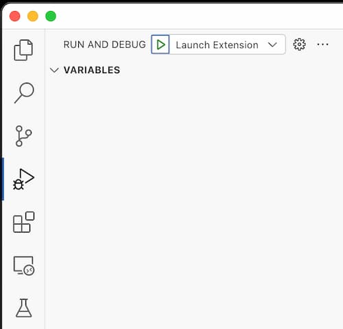

# Contributing

[Pull Request][pr] & [Issues][issues]

## Project Structure

```
<project-root>
  + assets                Downloaded hints/references data
  + docs                  Documentations for this project
  + scripts               Some bash scripts for building, publishing, and fixing 
  + src
    + additonal_snippets  Extra Visual Studio Code snippets beyond the downloaded snippets
	+ extension           Source code about Visual Studio Code extension
	  + main.desktop.ts   The entrypoint for the desktop extension
	  + main.web.ts       The entrypoint for the web extension
	+ libs                Third-party library/code
	+ syntax              Nginx configuration syntax files and generator
	+ utils               Utilities for downloading and generating hints/references data
  + test
```


## Prerequisites

- [Git](https://git-scm.com/)
- [Node.js](https://nodejs.org/en/)
- [Yarn Classic](https://classic.yarnpkg.com/en/)
- [Visual Studio Code](https://code.visualstudio.com/)

## References

- <https://code.visualstudio.com/api>
- The difference between web extension and desktop extension: <https://code.visualstudio.com/api/extension-guides/web-extensions>

## Pull and Initialize

``` bash
git clone https://github.com/hangxingliu/vscode-nginx-conf-hint.git
cd vscode-nginx-conf-hint

# Install full dependencies:
yarn install

# OR You can install without optional dependencies:
# These optional dependencies will not break the building of this project, 
# but they are used for linting, testing, and release
yarn install --ignore-optional
```

## Build

``` bash
# Build this project as desktop extension
yarn build:desktop-ext

# Build this project as a web extension
yarn build:web-ext

# Build utils in this project
yarn build:utils
```

## Update Hint Data

``` bash
yarn build:utils
node src/utils/download_hint_data
node src/utils/download_http_headers
node src/utils/download_lua_hint_data
node src/utils/download_mimetypes
```

## Debug

### Desktop Extension 

Select "Launch Extension" in your Visual Studio Code like the following screenshot:



Then press <kbd>F5</kbd> for debugging.

### Web Extension

``` bash
yarn run test:web-ext 
```


[issues]: https://github.com/hangxingliu/vscode-nginx-conf-hint/issues
[pr]: https://github.com/hangxingliu/vscode-nginx-conf-hint/pulls
